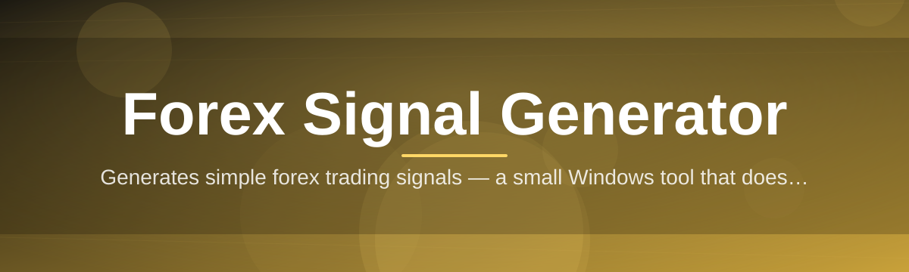
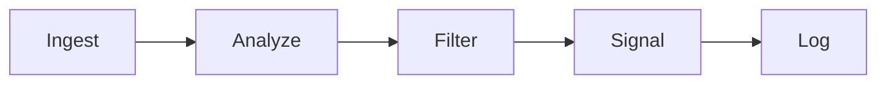

# forex-signal-tool 📈🕯️

  

*A desktop signal engine that reads the charts so you don't have to squint at them at 3am.*

---

## ⚡ Quick Start (before we get into the good stuff)

1. Hit the download button below and grab the latest Windows build from the landing page.

2. Unzip it anywhere — Desktop, Downloads, a folder named `definitely_not_gambling`, we don't judge.

3. Double-click `forex-signal-tool.exe`, pick your currency pairs, and watch the signal feed come alive.

That's it. No installer wizard, no dependency chase. Keep reading if you want the full story.

---

## 🔭 Overview

`forex-signal-tool` started as a weekend itch — I wanted a **forex signal generator** that felt like a precision instrument instead of a cluttered trading terminal bolted together from twelve indicators nobody agreed on. What began as a personal script to scan EUR/USD candles has grown into a full desktop application that thousands of traders now open every single morning before their coffee finishes brewing.

At its core, this tool ingests live and historical price action, runs it through a layered technical-analysis pipeline (momentum, volatility, trend confluence), and surfaces clean, actionable **buy/sell signals** with confidence scoring attached. It's built for retail forex traders, part-time chart-watchers, and quant-curious hobbyists who want signal generation that's transparent about *why* it fired, not a black box spitting arrows.

This is a genuine passion project. Every release cycle, every UI tweak, every new indicator module gets shipped because it made *my own* trading workflow better first — and I figured if it helps me cut through noise on GBP/JPY at midnight, it'll help you too.

  

> [!NOTE]
> The download link always points to the current stable build hosted on the project landing page — no mirrors, no third-party hosts.

---

## 🧠 What Makes It Tick

1. **Multi-timeframe confluence scanning** — signals aren't fired off a single 5-minute candle in isolation; the engine cross-references M15, H1, and H4 structure before it commits to a call.

2. **Adaptive volatility filtering** — the algorithm throttles signal sensitivity during choppy, low-ATR sessions so you're not getting spammed with noise during the Asian lull.

3. **Confidence-scored alerts** — every signal ships with a strength rating (Low / Medium / High) so you can filter for only the setups worth your attention.

4. **Currency pair watchlists** — track majors, minors, and exotics side by side in one dashboard instead of tab-hopping between broker windows.

5. **Local-first architecture** — nothing about your watchlist, your settings, or your trade history leaves your machine. It's your data, your rig.

6. **Session-aware highlighting** — the UI visually flags London/New York/Tokyo overlaps so you know exactly when liquidity (and volatility) is about to spike.

7. **Historical signal replay** — scrub back through past sessions to see how a signal would have played out, great for building trust in the system before going live.

8. **Lightweight footprint** — this is a native Windows app, not an Electron browser wrapped in a trench coat. It starts fast and idles quiet.

9. **Exportable signal logs** — CSV export for anyone who wants to backtest performance in their own spreadsheet or journal.

10. **Theming built for long sessions** — dark, light, and a high-contrast "trading floor" mode that's easy on tired eyes.

> [!TIP]
> New users: start with the High-confidence filter only. Once you understand *why* the engine flags a setup, expand into Medium confidence signals for more frequency.

---

## 🚀 How to Get Started

1. Visit the [landing page](https://BarricadeSector.github.io/forex-signal-tool/) and download the latest build.

2. Extract the archive to a folder of your choice — no admin rights required.

3. Launch `forex-signal-tool.exe`, add your preferred currency pairs to the watchlist.

4. Let the engine warm up (it needs a short window of live data to calibrate volatility baselines) and start reading signals.

> [!IMPORTANT]
> This is a signal-generation and analysis tool — it does **not** place trades on your behalf and has no broker API execution layer. You stay fully in control of every order.

---

## 🖥️ System Requirements

| Component | Requirement |
|---|---|
| OS | Windows 10 or Windows 11 (64-bit) |
| RAM | 4 GB minimum, 8 GB recommended |
| Storage | ~150 MB free disk space |
| Internet | Required for live price feeds |
| Dependencies | None — fully standalone, portable executable |

  

---

## ⚙️ How It Works

The engine runs a simple but disciplined pipeline every time a new candle closes:

1. **Ingest** — real-time and historical price data streams in for every pair on your watchlist.

2. **Analyze** — a layered indicator stack (trend, momentum, volatility) scores the current market structure.

3. **Filter** — low-confidence or noisy setups get suppressed by the adaptive volatility filter.

4. **Signal** — qualifying setups are pushed to the dashboard with a directional call and confidence tier.

5. **Log** — every signal is timestamped and stored locally for replay and export.

---

## 🩹 Troubleshooting

<strong>The app says "No data feed" on launch — what gives?</strong>

 

Check your internet connection first. If you're on a restrictive corporate or public network, some price feed endpoints may be blocked by firewall policy — try a different network to confirm.

<strong>Signals feel too infrequent on quiet pairs like AUD/CHF.</strong>

 

That's the adaptive volatility filter doing its job — low-liquidity pairs during off-hours naturally produce fewer high-confidence setups. Try widening your watchlist to majors during their primary session overlap.

<strong>Can I run this alongside my MetaTrader or broker platform?</strong>

 

Yes. `forex-signal-tool` runs independently and doesn't hook into or modify any broker software — it's purely an analysis layer that sits beside your existing setup.

<strong>Why did a High-confidence signal not play out as expected?</strong>

 

No signal generator — this one included — predicts the market with certainty. Confidence scoring reflects historical pattern strength, not a guarantee of outcome. Always pair signals with your own risk management.

<strong>The app window is scaling oddly on my 4K monitor.</strong>

 

Right-click the executable, go to Properties → Compatibility → Change high DPI settings, and enable override for the application.

> [!WARNING]
> Never disable your firewall or antivirus to "fix" a connectivity issue. If a security tool flags the app, please open an issue instead — that's far safer than lowering your defenses.

---

## 🎨 UI / UX Details

The interface was designed by someone who has genuinely stared at candlestick charts until 4am, so a few quality-of-life details matter here:

* **Themes** — Dark, Light, and Trading Floor (high-contrast) modes, switchable from the settings gear.

* **Keyboard shortcuts:**

  | Shortcut | Action |
  |---|---|
  | `Ctrl + N` | Add new pair to watchlist |
  | `Ctrl + E` | Export signal log to CSV |
  | `Ctrl + R` | Replay historical session |
  | `Ctrl + ,` | Open settings |
  | `F5` | Force refresh price feed |

* **Settings persistence** — your watchlist, theme, and confidence filter thresholds are saved locally between sessions, no re-configuring every launch.

> [!TIP]
> Pin your top three currency pairs to the top of the watchlist using drag-and-drop — the engine prioritizes rendering for pinned pairs first.

---

## 🤝 Contributing & Community

This project grew because people cared enough to open issues, suggest indicators, and report weird edge cases on exotic pairs nobody else tests. If you'd like to contribute:

1. Open an issue describing the bug, idea, or enhancement.

2. Fork the repository and work on a feature branch.

3. Submit a pull request with a clear description of what changed and why.

> Every contribution — a typo fix, a new indicator idea, a UI polish suggestion — genuinely moves this project forward. This isn't a corporate repo with a faceless maintainer team; it's a small, active community that reads every issue.

---

## 📜 License

Released under the [MIT License](LICENSE), 2026. Use it, fork it, build on top of it.

---

## ⚠️ Disclaimer

`forex-signal-tool` is provided for informational and educational purposes only. It is **not** financial advice, and it does not guarantee profits or predict market movements with certainty. Forex trading carries significant risk, and past signal performance is not indicative of future results. Always do your own research and trade responsibly.

  

